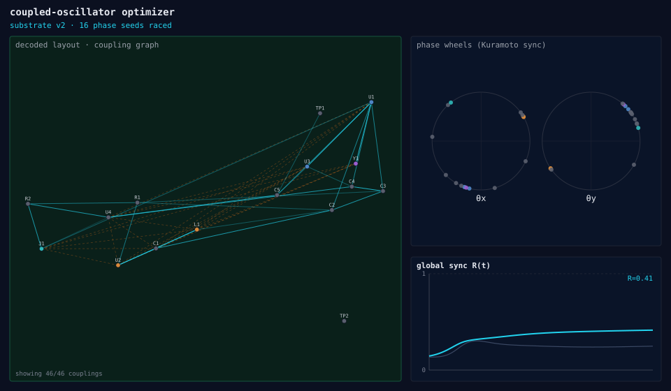
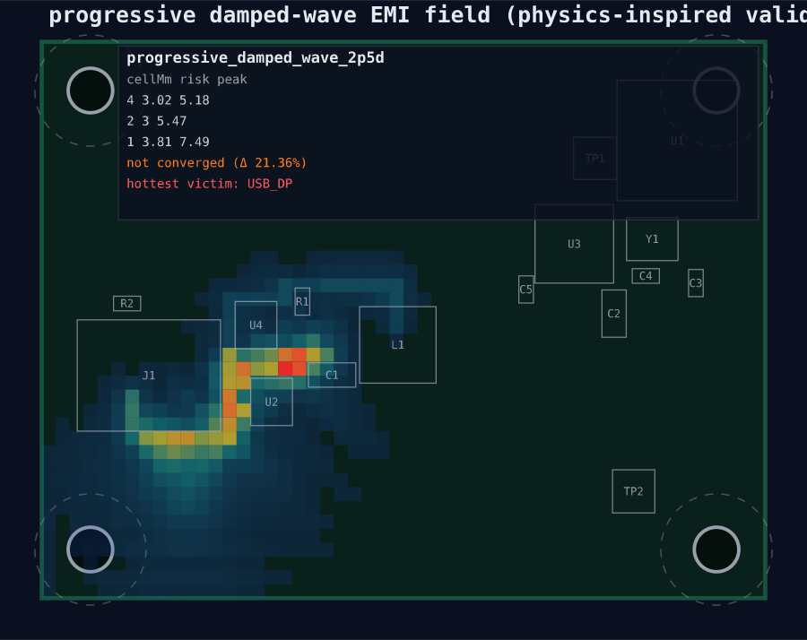
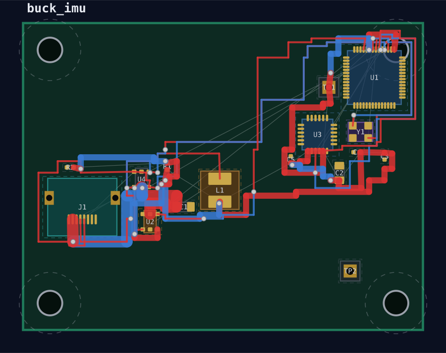
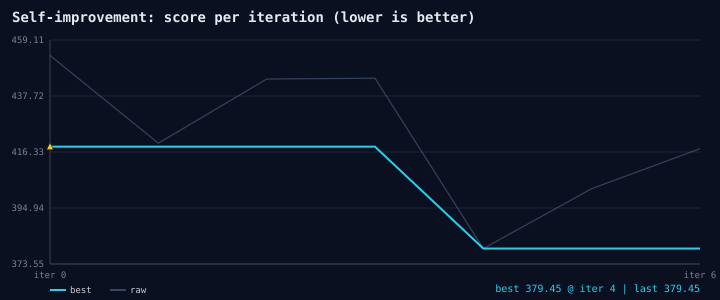

# layla

**A recursively self-improving AI for PCB design.** Feed it a KiCad schematic
(`.kicad_sch`); it parses, classifies, places, routes, and scores a real
KiCad board (`.kicad_pcb`) — and gets **measurably** better on every iteration.
It ships as both an **Electron desktop app** (with clickable example boards) and
a **CLI** (batch mode), and it runs **fully offline**: no `kicad-cli`, no network,
no API keys.

The core optimizer is a **coupled-oscillator (Kuramoto) substrate**. The netlist
is compiled into a network of phase oscillators — components are nodes; shared
nets become **attractive (synchronizing)** couplings (synchronized phase ⇒ nearby
placement); noisy↔sensitive net pairs become **anti-phase (repelling)** couplings
(separation). A **conditioning block** (board intent + thermal hotspots)
modulates those couplings. Many random initial-phase seeds are raced;
each synchronized phase field is decoded to coordinates via
`coord = boardSize · sigmoid(a·sinθ + b·cosθ)`, then a light de-overlap
legalization runs. This substrate is **what the RSI loop recursively improves**.
(The original simulated-annealing optimizer remains the documented baseline,
selectable with `--optimizer anneal`.)

The substrate idea is borrowed from **Un‑0**, which generates images with a
population of coupled oscillators steered by a class-conditioning block
([blog](https://unconv.ai/blog/introducing-un-0-generating-images-with-coupled-oscillators/),
[code](https://github.com/unconv-ai/Un-0)). layla reuses the *mechanism*
— coupled oscillators + a conditioning drive — as an **optimizer substrate for
placement**, not for image generation: the oscillators encode component
coordinates, and the "image" is a routed, scored PCB layout.

The whole thing is a **ratchet**. Each iteration explores fresh placements
through an `OptimizerBackend`, then proposes candidates (substrate mutation
and/or symbolic rules, depending on the optimizer). **Every** resulting
`CandidateLayout` is judged by the **same ordered gate list**: promote only if
the canonical score improves, and — when `--emi` is on — if the independent EMI
field check does not regress. EMI risk is a property of layout geometry, not of
which mechanism proposed the candidate; rule-derived and substrate-derived
layouts face the same checks. Learning *channels* still differ by optimizer
(anneal → symbolic rules; oscillator → substrate mutation — see
[Deterministic vs learned optimizers](#deterministic-vs-learned-optimizers)),
but evaluation does not. Because promotion is gated on the objective, the best
score is **monotonically non-increasing** across iterations — the design can
only get better or stay flat, never regress. And it is not vibes: the objective
is a concrete **geometric + field-risk score** — ratsnest length, courtyard/DRC
violations, buck switch-loop area, noisy↔sensitive coupling, antenna keepout,
and thermal density. Lower is better, and that single number is the thing the
loop drives down.

---

## Deterministic vs learned optimizers

This is an architectural **decision**, not a temporary limitation:

| Optimizer | Learning / guidance channel |
| --- | --- |
| **Deterministic (`anneal`)** | Explicit human-guided **symbolic rules** compiled from `--feedback` (and hotspot synthesis): `push_away`, `cluster_tight`, `anchor_edge` as search-space constraints. |
| **Learned (`oscillator`; future GNN/RL)** | Optimization driven by **learned representations** — today, `OscSubstrate` mutation; later, learned policies — **not** by injecting symbolic rule constraints into the placement graph. |

When `--feedback` is passed with `--optimizer oscillator`, the run **continues
normally** but prints (and records in `report.json`) an explicit notice that
symbolic rules apply to anneal only and that this run's learning channel is
substrate mutation. Transfer demos carry the **evolved substrate**, not a count
of "learned rules," as what makes the oscillator better on a new board.

Scoring always uses the fixed `DEFAULT_WEIGHTS` yardstick. There is no
`ruleset.weights` / weight-delta mechanism.

---

## Gallery

Generated by the engine (see [`docs/gallery/`](docs/gallery); regenerate with
`npm run demo`).

| The coupled-oscillator optimizer | Independent EMI field validation |
| --- | --- |
|  |  |
| Coupling graph (cyan = attract/sync, orange = anti-phase repel), θx/θy phase wheels, and the global sync order parameter `R(t)`. | Progressive damped-wave field, refined 4→2→1 mm, with the hottest victim net flagged. |

| Placed & routed board | Self-improvement curve |
| --- | --- |
|  |  |
| Real `.kicad_pcb` — F.Cu (red) / B.Cu (blue) traces, vias, courtyards, mounting holes. | The substrate evolves `v1→v3`; the bright line (best score) is monotonic. |

---

## How it works

The pipeline runs in this order, all in TypeScript, all offline:

1. **Parse `.kicad_sch`** (`core/schematic.ts`) — an S-expression reader for the
   raw symbol/wire/label tree.
2. **Offline netlister** (`core/schematic.ts`) — recovers connectivity with
   **union-find** over wire endpoints, coincident symbol-pin positions, and label
   names (matching KiCad single-sheet behavior). Power symbols contribute a global
   label equal to their value. No `kicad-cli` required.
3. **Role / topology classifier** (`core/classify.ts`) — assigns each component a
   *role* (mcu, regulator, inductor, imu, adc, motor_driver, rf, antenna, decap,
   input/output cap, usb, crystal, …), classifies each net (`ground`, `power`,
   `high_current`, `noisy`, `usb`, `clock`/`sensitive`, …), and groups parts into
   functional **clusters** (`buck_converter`, `usb`, `rf`, `sensor`, `motor`).
4. **Procedural footprint geometry** (`core/footprints.ts`) — synthesizes real pad
   geometry from footprint ids (no KiCad libraries assumed present), with pad
   numbers that match schematic pins so nets bind correctly in the output board.
5. **Coupled-oscillator placement** (`core/osc.ts`, default) — compiles the
   design into a signed-coupling Kuramoto graph (net adjacency ⇒ attraction,
   cluster cohesion ⇒ extra attraction, noisy↔sensitive ⇒ anti-phase repulsion,
   decap→IC ⇒ attraction), integrates the phases (optionally inertial /
   second-order) over a **batch of random initial-phase seeds**, decodes each
   synchronized phase field to coordinates, snaps edge-anchored parts
   (USB/connector→left, antenna/RF→right), and runs a light de-overlap
   legalization. The annealer (`core/place.ts`) is the selectable **baseline**
   (`--optimizer anneal`) and is also reused as the short legalization polish.
6. **Grid A\* router with negotiated congestion** (`core/route.ts`) — routes
   demand nets over a coarse two-layer (F.Cu/B.Cu) occupancy grid with via
   costs. **Tiered coverage:** small (`buck_imu`, `motor_driver`, `rf_sensor`)
   and medium (`robot_soc`) attempt **all** non-ground demand nets; stress
   (`mainboard`) stays **critical/capped**. Failed routes may rip up at most
   two lower-priority victim nets, apply congestion history costs, and retry
   for at most three deterministic passes — foreign-net occupancy remains a
   **hard block** (never a soft cost that could permit shorts). Unrouted nets
   are reported honestly; do not assume universal completion on large boards.
7. **Field-proxy scoring + hotspots** (`core/score.ts`) — computes the canonical
   objective and emits ranked **hotspots** (e.g. *"buck hot loop area 130mm²"*,
   *"SW within 2.4mm of sensitive IMU_SCL"*) with suggested actions.
8. **Independent EMI validation** (`core/emi.ts`, optional via `--emi`) — a
   progressive 2.5D damped-wave voxel solver estimates near-field coupling risk
   *independently* of the optimizer's objective (see [EMI section](#emi-independent-field-validation)).
9. **Rule / substrate synthesis** (`core/rules.ts`, `core/osc.ts`) — under
   **anneal**, turns hotspots and `--feedback` into symbolic layout rules; under
   **oscillator**, mutates the `OscSubstrate` (symbolic `--feedback` is notice-only).
10. **Promotion-gated ratchet** (`core/synth.ts`, `core/optimizerBackend.ts`) —
    re-optimizes with each candidate through one `OptimizerBackend` dispatch,
    then runs every `CandidateLayout` through the **same gate list**
    (`canonical_score` → exact `drc_clearance_non_regression` → EMI when
    `--emi` is on). Learning channels still differ by optimizer (symbolic
    rules vs substrate mutation), but **evaluation does not** branch on
    candidate provenance.
11. **Board emission + integrity checks** (`core/board.ts`, `core/lvs.ts`,
    `core/drc.ts`) — writes the final `.kicad_pcb`, then independently
    re-derives connectivity from *that emitted text* and diffs it against the
    schematic (LVS-equivalent), and separately checks copper-to-copper
    clearance between every pad/trace/via pair belonging to different nets
    against `board.clearance`. See
    [Verification: LVS + clearance DRC](#verification-lvs--clearance-drc).

### Why scores stay comparable (and why transfer is valid)

Success is **always measured against a fixed canonical yardstick**
(`DEFAULT_WEIGHTS`). The oscillator path is guided by the evolved
`OscSubstrate`; the anneal path is guided by symbolic rules. Neither path
retunes the objective weights:
```ts
// core/synth.ts — synthOnce() via OptimizerBackend
const backend = createBackend(optimizer);          // anneal | oscillator
const { candidate, score } = materializeCandidate(backend, req);
// GUIDED by backend-owned state (substrate / rules); JUDGED canonically
scoreLayout(design, candidate.layout, DEFAULT_WEIGHTS);
```

Because every layout — under every substrate/ruleset, on every board, under either
optimizer — is graded on the same objective, scores are directly comparable across
iterations, across optimizers, and across boards. That is exactly what makes the
ratchet sound, what lets the oscillator and the annealer be benchmarked
head-to-head (`bench`), and what makes an **evolved substrate** (or anneal rule
set) learned on one board transferable to another under the matching optimizer.

### The score (what "better" means)

The objective is a weighted sum of geometric and field-risk terms (lower = better):

| Term | What it penalizes |
| --- | --- |
| `ratsnest` | Total MST wire length of unrouted nets |
| `crossings` | Ratsnest edges of different nets crossing |
| `courtyard` | Component courtyard overlaps |
| `offboard` | Geometry pushed outside the board outline |
| `decap` | Decoupling caps far from the IC they bypass |
| `switchLoop` | Buck input-cap→regulator→inductor hot-loop area |
| `noisySensitive` | Proximity of noisy/high-current nets to sensitive nets |
| `usbPair` | USB diff-pair length and skew |
| `antenna` | Objects inside antenna keepout / antenna off the board edge |
| `highCurrent` | Length × current of high-current paths |
| `thermal` | Heat-source (regulator/driver/MOSFET) density |
| `returnPath` | Sensitive nets routed across noisy clusters |
| `drc` | Courtyard/off-board proxy **plus** broad-phase copper clearance pair count (`checkClearanceBroad`) — feeds the optimizer objective (`DEFAULT_WEIGHTS.drc` = 20) |

This `drc` term is the **in-loop** legality signal: courtyard/off-board plus a
cheap **broad-phase** copper count (pad AABB / coarse primitive bounding-box
pairs within clearance). It is intentionally coarser than exact narrow-phase
geometry. Exact clearance (`checkClearance`) is a separate always-on promotion
gate (`drc_clearance_non_regression`) and still lands in `report.json`'s `drc`
field at emit time — see [Verification](#verification-lvs--clearance-drc).
The report also exposes normalized **field scores** (`coupling`, `returnPath`,
`switching`, `antenna`, `thermal`) in `[0,1]`.

---

## EMI: independent field validation

The geometric score above is what the optimizer *drives*. To check it against
something the optimizer can't game, layla ships a **separate** field
validator (`core/emi.ts`) — and the two are deliberately not conflated:

> **Oscillator dynamics PROPOSE layouts; the voxel ODE pass VALIDATES field risk
> independently.** The validator never proposes placements, and the optimizer
> never scores its own field safety.

The validator is a **progressive, physics-inspired damped-wave 2.5D voxel solver**.
The board is discretized into a `cols × rows` grid with three z-layers:

| z | layer | role |
| --- | --- | --- |
| 0 | F.Cu signal | sources (noisy / high-current nets) and probes (sensitive nets) live here |
| 1 | dielectric | couples the two copper layers |
| 2 | B.Cu ground | run with strong damping so it acts as an **energy sink** (return/shield plane) |

A leapfrog damped-wave update is integrated over the volume; aggressor nets inject
an oscillating drive, component courtyards act as lossy obstacles, and vias bleed
energy from the signal layer into the ground sink. The pass is **progressive**:
it refines through cell sizes `[4, 2, 1] mm` and runs a **convergence check**
across refinement. It reports:

- per-level `{ cellMm, risk, peak, probeEnergy }`,
- `converged?` and `convergenceDeltaPct` (**refinement stability / ranking
  confidence** when the finest-vs-second-finest risk delta is `< 12%` — not EMC
  compliance),
- the report `scope` field (always `EMI_SCOPE_CLAIM`),
- the **hottest victim net** (`sensitiveProbeMax`) and a per-probe risk ranking,
- a normalized **field heatmap** of `max|u|` over time on the finest grid.

**Be honest about what this is.** Exact approved scope (`EMI_SCOPE_CLAIM` in
`core/emi.ts`, echoed on every report surface):

> Flags relative near-field coupling risk between two placements for ranking
> purposes only; risk is a unitless comparative near-field coupling-risk
> estimate, never absolute field strength (dB/V/m) or EMC compliance.

It is *physics-inspired progressive validation* — **not certified EMC** and not a
substitute for a real field solver or lab testing. `emiRisk()` (used by the
promotion gate) compares the **finest-level blended scalar** between layouts,
not dB/V/m. `converged` / `convergenceDeltaPct` mean **refinement stability /
ranking confidence** across cell sizes — not compliance; the gate does **not**
skip or soften when `converged` is false. When `--emi` is on, the validator
acts as a **promotion gate on every candidate** (rule-derived or
substrate-derived): a layout that lowers the canonical score but regresses field
risk (beyond a small tolerance: `emiRisk(cand) ≤ emiRisk(best) × 1.08`) is
rejected. The ordered gate list in `optimizerBackend.ts` is:
`canonical_score` → `drc_clearance_non_regression` (exact copper clearance,
always on) → `emi_non_regression` (when `--emi` is on). Future checks append
here without touching backend or dispatch code.

---

## Verification: LVS + clearance DRC

An internal audit ([`LAYLA_AUDIT.md`](LAYLA_AUDIT.md)) found that nothing in
the pipeline verified the *emitted* `.kicad_pcb` against anything — a
footprint-synthesis bug could silently drop a schematic pin from the board
with zero signal anywhere, and the router's obstacle model was a soft cost,
so two different nets could legally share copper in the same grid cell if
that was cheaper than detouring. Both are now closed, plus a general-purpose
check for either class of bug recurring in the future:

- **LVS-equivalent connectivity check** (`core/lvs.ts`, `verifyLvs`) —
  re-parses the actual emitted `.kicad_pcb` text (not the in-memory
  `Design`/`Layout` that produced it) and diffs its pad-to-net bindings
  against the schematic's own netlist. Reports `missing` (a schematic pin
  with no matching board pad), `extra` (a board pad on a real net the
  schematic never declared), and `netMismatch` (same pin, different net) —
  each as structured data, not just a printed message.
- **Copper clearance DRC** (`core/drc.ts`) — two tiers:
  - **Broad** (`checkClearanceBroad`): pad-AABB / coarse primitive bounding-box
    pairs within `board.clearance` — feeds `score.drcErrors` in-loop.
  - **Exact** (`checkClearance`): full narrow-phase geometry (pads as
    rotation-aware boxes, traces as capsules, vias as circles). Used as the
    always-on promotion gate `drc_clearance_non_regression` (reject only if
    exact violation count exceeds the current best) and written to
    `report.json.drc` at emit. Scoped to preventing shorts — annular-ring and
    trace-width-vs-current checks aren't implemented.

Both run automatically at the end of every `synth`/`demo`/`batch` invocation
and land in `<name>.report.json` as `lvs` and `drc` objects (`clean: boolean`
plus the violation list). They're **assistive, not a hard gate**: a
mismatch prints a warning line but does not change the CLI's exit code —
`report.json`'s `lvs.clean` / `drc.clean` fields are the signal for a human
or downstream review process to act on.

```bash
npm run check-footprints   # every bundled component's footprint pads match its schematic pin numbers
npm run check-lvs          # all 5 bundled boards are lvs.clean, + a manufactured-regression negative case
npm run check-drc          # zero shared grid cells (router hard-block) + zero clearance violations,
                            # including every *fixed* footprint template checked in isolation
npm run check-inloop-drc   # broad-phase score signal + exact DRC promotion non-regression fixtures
npm run check-routing-completeness  # tiered route targets + determinism + hard-block + rip-up ownership
npm run check-rules-scope  # weights removed; anneal feedback vs oscillator notice
npm run check-optimizer-backend  # OptimizerBackend + uniform gates (score → DRC → EMI)
npm run check-emi-scope          # EMI relative-ranking scope claim + risk ordering + uniform gate
```

These are gate tests, not unit tests in a framework — each is a standalone
script under `src/scripts/` (same convention as `gen-examples.ts`) that
exits non-zero on failure. `check-drc` and `check-lvs` each include a
stub-swap proof (temporarily replace the real check with one that always
reports clean, confirm the gate's own negative case then correctly fails)
so the gate is proven to actually detect the bug class it exists for, not
just proven to not currently trigger.

---

## Quick start

```bash
npm install
npm run build          # tsc → dist/
npm run gen-examples   # synthesize the bundled example schematics
npm start              # launch the Electron desktop app
```

Or do it all in one shot:

```bash
npm run app    # build + gen-examples + launch the desktop app
npm run demo   # build + gen-examples + run the CLI demo across all boards
```

`npm run demo` runs the self-improvement loop on all five example boards and then
runs the **transfer demo** (evolve the oscillator substrate on the buck board,
apply it as a better optimizer to a brand-new motor board with zero new feedback).
All artifacts land in `build/`. Use `node dist/cli.js bench` for the
oscillator-vs-annealing head-to-head, and `npm run check-lvs` / `npm run check-drc`
for the connectivity/clearance gate tests (see
[Verification: LVS + clearance DRC](#verification-lvs--clearance-drc)).

---

## CLI reference

```text
layla inspect <board.kicad_sch>
layla synth   <board.kicad_sch> [--optimizer oscillator|anneal] [--emi]
                                       [--out out.kicad_pcb] [--iterations N]
                                       [--rules rules.json] [--feedback "..."] [--config cfg.json]
layla learn   <board.kicad_sch> --feedback "keep buck away from imu" [--out rules.json]
layla batch   <dir|file>        [--optimizer oscillator|anneal] [--emi] [--iterations N] [--out build/]
layla demo                       [--iterations N]
layla bench                      [--iterations N]   # oscillator vs annealing, head-to-head
```

Invoke via `npm run cli -- <args>` or directly with `node dist/cli.js <args>`.

| Command | Purpose |
| --- | --- |
| `inspect` | Parse a schematic and print components, detected roles, clusters, and nets — no placement. |
| `synth` | Run the full improve loop on one board; write the board, SVGs, report, and learned rules. |
| `learn` | Compile human `--feedback` into reusable layout rules (a short 4-iteration run) and save them to JSON. |
| `batch` | Run `synth` over every `.kicad_sch` under a directory (or a single file) and write a `batch-summary.json`. |
| `demo` | Run all bundled examples plus the learn→transfer demonstration. |
| `bench` | Run **both** optimizers (annealing vs coupled-oscillator) on every example board and print a head-to-head score/time table. |

### Flags

| Flag | Applies to | Meaning |
| --- | --- | --- |
| `--optimizer <oscillator\|anneal>` | synth / batch | Which optimizer to drive the ratchet. **Default `oscillator`** (coupled-oscillator Kuramoto substrate); `anneal` selects the simulated-annealing baseline. |
| `--emi` | synth / batch | Run the progressive voxel damped-wave EMI validation pass and use it as a non-regression promotion gate. |
| `--out <path>` | synth / learn / batch | Output board path (synth), rules file (learn), or output root dir (batch). |
| `--iterations <N>` | synth / batch / demo / bench | Number of ratchet iterations (default 8). |
| `--rules <file>` | synth / learn | Load a previously learned ruleset (rules + evolved substrate) to start from. |
| `--feedback "<text>"` | synth / learn | Natural-language guidance compiled into rules (e.g. *"keep the buck hot loop tight and away from the imu"*). |
| `--config <file>` | synth / learn | Board config (`width`/`height`/`diffPairs`); auto-detected as `layla.json` next to the schematic. |
| `--seed <N>` | synth | Deterministic RNG seed (default 1337). |

### Benchmark results

`bench` grades both optimizers on the same canonical yardstick, so the comparison
is apples-to-apples. On the 5 bundled boards (default 8 iterations, seed 1337 —
`node dist/cli.js bench` with no flags) the **coupled-oscillator substrate
beats the annealing baseline by ~13–77%** (lower score is better):

```text
board              anneal     oscillator   Δ      substrate
mainboard          89215.5    20423.2     -77%   v1
robot_soc          11402.0     4714.9     -59%   v2
buck_imu             623.9      376.1     -40%   v3
motor_driver         651.7      568.2     -13%   v3
rf_sensor            435.5      152.3     -65%   v4
```

This run is deterministic (fixed seed, fixed iteration count) — reproduce it
exactly with `layla bench`. These numbers reflect the current pipeline,
including the routing hard-block and clearance-DRC fixes above; they will
differ from any numbers you may have seen quoted before those landed (route
completion changed on some boards once the router could no longer let two
nets share a cell). Cross-board substrate transfer is **raced** (cold default
vs warm transferred) when provenance hashes mismatch — see
[Learning and transfer](#learning-and-transfer); `npm run check-transfer-race`
is the gate evidence.

### Examples

```bash
# Inspect topology only
node dist/cli.js inspect examples/buck_imu/buck_imu.kicad_sch

# Full self-improvement run (oscillator substrate by default), writing a board out
node dist/cli.js synth examples/buck_imu/buck_imu.kicad_sch \
  --iterations 10 --out build/buck_imu.kicad_pcb

# Same board, with the independent EMI field validation gate on
node dist/cli.js synth examples/buck_imu/buck_imu.kicad_sch --emi

# Use the annealing baseline instead of the oscillator substrate
node dist/cli.js synth examples/buck_imu/buck_imu.kicad_sch --optimizer anneal

# Head-to-head: oscillator vs annealing across the example boards
node dist/cli.js bench

# Learn a transferable rule from feedback
node dist/cli.js learn examples/buck_imu/buck_imu.kicad_sch \
  --feedback "keep the buck hot loop tight and away from the imu" \
  --out build/emi.rules.json

# Apply learned rules to a different board
node dist/cli.js synth examples/motor_driver/motor_driver.kicad_sch \
  --rules build/emi.rules.json --out build/motor.kicad_pcb

# Batch every schematic in a tree
node dist/cli.js batch examples --out build
```

### Output files (per board)

| File | Contents |
| --- | --- |
| `<name>.kicad_pcb` | Placed & routed KiCad board (KiCad 7/8 style). |
| `<name>.board.svg` | Rendered board view. |
| `<name>.heatmap.svg` | Field-risk (geometric proxy) heatmap with hotspots. |
| `<name>.oscillator.svg` | Coupled-oscillator view: phase field, signed couplings, and the Kuramoto sync order parameter over the seed race (oscillator runs only). |
| `<name>.emi.svg` | Progressive damped-wave EMI field heatmap (finest level) with the hottest victim net. |
| `<name>.curve.svg` | Learning curve (score per iteration). |
| `<name>.report.json` | Scores, term breakdown, iteration history, learned rules, evolved substrate, EMI summary, improvement %, plus `lvs` (connectivity check) and `drc` (clearance check) — see [Verification](#verification-lvs--clearance-drc). |
| `<name>.rules.json` | The ruleset: symbolic anneal rules (if any) + evolved `OscSubstrate` (if any). No weight-delta field. |

`batch` additionally writes `batch-summary.json`.

---

## Example boards

Five mixed-signal boards are bundled (see `examples/index.json`). Each is a real
synthesized `.kicad_sch` with a `layla.json` board config, ranging from a
13-part sensor board to a ~200-part autonomy mainboard.

| Name | Title | The layout tension |
| --- | --- | --- |
| `buck_imu` | Buck + ESP32 + IMU sensor board | ESP32-S3, TPS62160 buck, USB-C, ICM-42688 IMU, 40 MHz crystal — keep the buck switching node away from the sensitive IMU/USB nets. |
| `motor_driver` | BLDC motor driver board | STM32G0 + DRV8313 + buck + INA240 current sensor — keep high-current motor nets and the buck away from sense/logic. |
| `rf_sensor` | BLE RF sensor board | nRF52840 + chip antenna + buck + BME280 — give the antenna a clear board-edge keepout away from the switcher. |
| `robot_soc` | Robotics control SoC | STM32H7 + DRV8353 3-phase BLDC stage (6 FETs + shunts) + nRF52840 radio + 3-buck power tree + USB-C + CAN + a 4-chip sensor cluster — dozens of fine SPI/I2C/PWM nets and high-current motor phases must coexist without coupling. |
| `mainboard` | Autonomy mainboard | AM62 SoC + RP2040 + ICE40 FPGA, dual LPDDR4, a six-rail power tree, FOUR 3-phase BLDC channels (24 FETs), an 8-chip sensor bus, two radios, Ethernet/CAN/RS485/USB — the **stress** routing tier (critical/capped + ≥5% default-budget completion; failed nets logged in `report.json.routing`). |

Small boards (`buck_imu`, `motor_driver`, `rf_sensor`) target **100%** demand-net completion under negotiated congestion. Medium (`robot_soc`) targets **≥98%** — the honest ceiling when placement scatters a low-priority net across protected copper (shortfalls are reason-tagged in `report.json.routing.unroutedFailures`, e.g. `blocked_by_protected_copper`). `mainboard` (stress) targets **≥5%** critical/capped completion with explicit unrouted-net reporting.

### Learning and transfer

This is the headline behavior, exercised by `npm run demo`:

1. **Evolve** the optimizer on `buck_imu`. Under oscillator, the RSI mutates the
   **substrate** and promotes only mutations that lower the canonical score — the
   substrate that comes out is a *better optimizer*, not just a better board.
   `--feedback` on this step is notice-only for oscillator (symbolic rules are
   anneal-only).
2. **Transfer** that evolved **substrate**, unchanged, to the
   brand-new `motor_driver` board — **with zero new feedback**. The motor board is
   optimized once from a **default** substrate and once from the **evolved**
   substrate, same seed and same small iteration budget. Symbolic rules are not
   part of what transfers under oscillator.
3. **Measure** the canonical score in both cases, under the same small (2-iteration)
   budget, so the comparison isolates the substrate itself rather than just more
   search time.

**Transfer under oscillator is race-guarded, not assumed helpful.** Cross-board
provenance mismatch auto-triggers two independent `improve()` lineages (COLD
default substrate vs WARM transferred); final `Score.total` keeps the winner
wholesale — transfer is strictly non-harmful by construction. Same-board
continuation does not race. Gate evidence: `npm run check-transfer-race`
(seed 42 selects COLD 624.1 over WARM 837.3; same-board no race; legacy
provenance notice; content-hash detection). Don't take an older "~24% better
optimizer" narrative on faith — that number predates the routing hard-block /
clearance-DRC fixes and the cold/warm race; run the gate (or `layla demo`) and
read the scores it prints.

This is still the whole thesis in miniature — the optimizer improves
*itself*, mutations are kept only when they measurably help on the board
they were evolved on, and cross-board transfer is judged on the same
canonical objective with an automatic cold/warm race when provenance says
the board changed.

---

## Architecture / repo map

### `src/core/` — the engine

| Module | Responsibility |
| --- | --- |
| `sexpr.ts` | S-expression parse/serialize for KiCad files. |
| `schematic.ts` | `.kicad_sch` parser + offline union-find netlister. |
| `classify.ts` | Component roles, net classes, functional clusters → `Design` IR. |
| `footprints.ts` | Procedural footprint/pad geometry. |
| `geometry.ts` | 2D math (points, boxes, areas, segment intersection). |
| `layoututil.ts` | Shared pad/courtyard world-coordinate helpers. |
| `oscTypes.ts` | Shared contracts: the promotable `OscSubstrate`, compiled `OscGraph`, viz payload, and `EmiReport`. |
| `osc.ts` | **Coupled-oscillator (Kuramoto) placement optimizer** — graph compile, batched phase integration, phase→coordinate decode, legalization; `defaultSubstrate` / `mutateSubstrate`. The RSI substrate. |
| `emi.ts` | **Independent progressive damped-wave 2.5D voxel EMI validator** (`validateEmiProgressive`, `EMI_SCOPE_CLAIM` relative-ranking scope). |
| `place.ts` | Anchored seeding + simulated-annealing placement (baseline + legalization polish). |
| `route.ts` | Grid A\* router with tiered coverage + bounded negotiated-congestion rip-up; hard-blocks foreign-net cells. |
| `score.ts` | Canonical objective + field-risk proxy + hotspot detection. |
| `rules.ts` | Symbolic rule synthesis from hotspots/`--feedback` (anneal constraints); no weight deltas. |
| `synth.ts` | Orchestrator: `designFromSchematic`, `synthOnce` via `OptimizerBackend`, and the `improve` ratchet (uniform gate-list evaluation). |
| `optimizerBackend.ts` | `OptimizerBackend` / `CandidateLayout`, anneal+oscillator adapters, ordered promotion gates (score → exact DRC → optional EMI). |
| `board.ts` | Emit `.kicad_pcb`. |
| `lvs.ts` | **LVS-equivalent connectivity check** (`verifyLvs`) — re-parses the emitted board and diffs it against the schematic. |
| `drc.ts` | **Two-tier copper clearance DRC** — broad (`checkClearanceBroad` → score) + exact (`checkClearance` → promotion gate + report). |
| `svg.ts` | Board / heatmap / learning-curve / oscillator / EMI-field renderers. |
| `schemgen.ts` | Author valid `.kicad_sch` (used to build the examples). |
| `rng.ts` | Seeded deterministic RNG. |
| `types.ts` | Shared IR types. |

### Apps and assets

- **`src/cli.ts`** — the command-line front end (`inspect`/`synth`/`learn`/`batch`/`demo`/`bench`).
- **`src/electron/`** — Electron `main.ts` (process bridge to the core) and `preload.ts`.
- **`app/`** — the renderer UI (`index.html`, `renderer.js`, `styles.css`) with the
  clickable example boards.
- **`src/scripts/gen-examples.ts`** — generates the bundled schematics into `examples/`.
- **`src/scripts/check-footprint-pads.ts`**, **`check-lvs.ts`**, **`check-drc.ts`**,
  **`check-inloop-drc.ts`**, **`check-routing-completeness.ts`** — gate tests behind
  `npm run check-footprints` / `check-lvs` / `check-drc` / `check-inloop-drc` /
  `check-routing-completeness` (see [Verification](#verification-lvs--clearance-drc)).
- **`examples/`** — the five example boards + `index.json`.
- **`docs/`** — design docs, including [`oscillator-architecture.md`](docs/oscillator-architecture.md)
  (the full propose-vs-validate / substrate-RSI walkthrough), and `docs/gallery/`
  (curated engine renders shown above).
- **`LAYLA_AUDIT.md`** — the capability audit that drove the routing/LVS/DRC/footprint
  fixes referenced throughout this README; read it for the full "what was
  broken, what's fixed, what's still known-limited" history.
- **`build/`** — generated outputs (git-ignored; created by `synth`/`batch`/`demo`).
- **`mojo/`** — the optional Mojo GPU acceleration path (see below).

### Mojo GPU path

The **working optimizer is the TypeScript reference** in `src/core/osc.ts`;
layla runs **fully without Mojo** — placement, routing, scoring, the EMI
field check, and the RSI loop all execute in TypeScript today.
`mojo/layla_kernels/kuramoto_place.mojo` is an *optional* GPU acceleration
kernel — a batched, sparse-CSR Kuramoto integrator that maps **1:1** to the TS
path and is expected to produce the same layouts for the same seeds. If the
Modular toolchain isn't installed, none of it is used. See
[`mojo/README.md`](mojo/README.md) and
[`docs/oscillator-architecture.md`](docs/oscillator-architecture.md) for depth.

---

## What it is / isn't

**It is** a fast, fully-offline *first-pass* layout engine plus a learning-review
loop for small **2-layer mixed-signal** boards. It produces a real, placed and
critically-routed `.kicad_pcb`, and it learns reusable EE layout heuristics that it
proves out against a measurable objective before keeping them.

**It isn't:**

- **A certified EMC tool.** Two field signals exist, neither is compliance. The
  optimizer's objective is a fast **geometric proxy** (switch-loop area, centroid
  coupling, keepout distances, thermal density). The optional `--emi` pass adds an
  **independent physics-inspired damped-wave voxel solver** whose sole approved
  claim is relative ranking: it flags comparative near-field coupling risk
  between two placements (`EMI_SCOPE_CLAIM` / `report.json.emi.scope`) — a unitless
  comparative estimate, never absolute field strength (dB / V/m) or EMC
  compliance. `converged` means refinement stability / ranking confidence across
  cell sizes, not a compliance verdict. The uniform `emi_non_regression` gate
  compares the finest-level blended scalar between layouts and does not change
  eligibility when unconverged. Useful as a model-based *cross-check*, not a
  substitute for a real field solver (e.g. openEMS) or lab testing.
- **A full autorouter.** Routing is **tiered**, not universal: small boards
  attempt all demand nets at 100%; medium (`robot_soc`) targets ≥98% with
  reason-tagged shortfalls when placement leaves a low-priority net blocked
  by protected copper; stress (`mainboard`) stays critical/capped with a ≥5%
  default-budget completion expectation. Bounded negotiated-congestion
  rip-up (≤2 lower-priority victims, ≤3 passes) never soft-crosses foreign
  copper. Check `report.json.routing` / `score.routeCompletion` rather than
  assuming high coverage on large boards.
- **A fab-rule DRC tool.** `core/drc.ts` checks copper-to-copper *clearance*
  only (pad/trace/via spacing against `board.clearance`) — no annular-ring
  check, no trace-width-vs-current-capacity check, no real fab rule deck.
  It's a real, useful minimum-spacing check, not KiCad's DRC.
- **A finishing tool.** Think of the output as an excellent, measurable *starting
  point* — not a fab-ready board.

---

## License

MIT.
